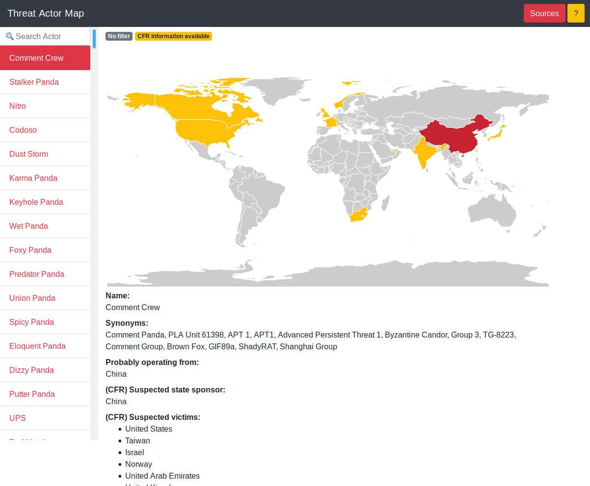

# Threat Actor Map

APTMAP: https://aptmap.netlify.com

This little webapp is just a little helper for me to get an overview about some publicly known threat actors. It's work in progress and the code is not beautiful, because this is the first JavaScript based project I ever started. If you have some tips or improvements, please create an issue and/or a pull request.  